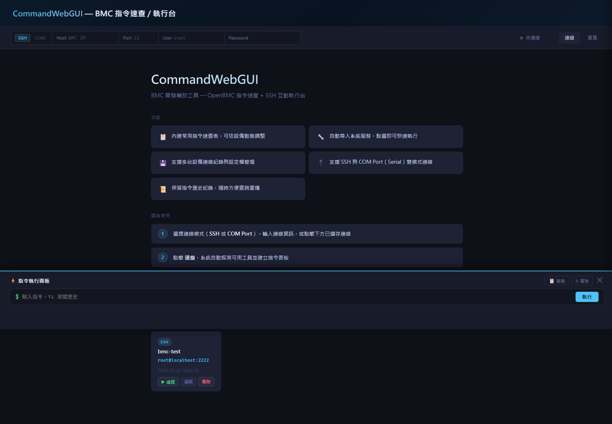
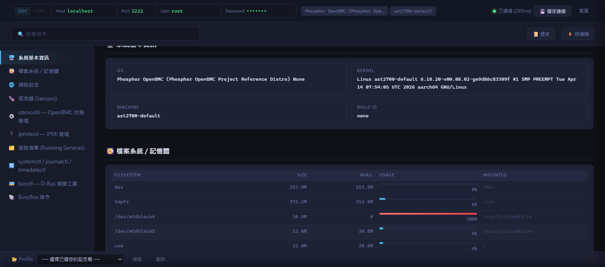
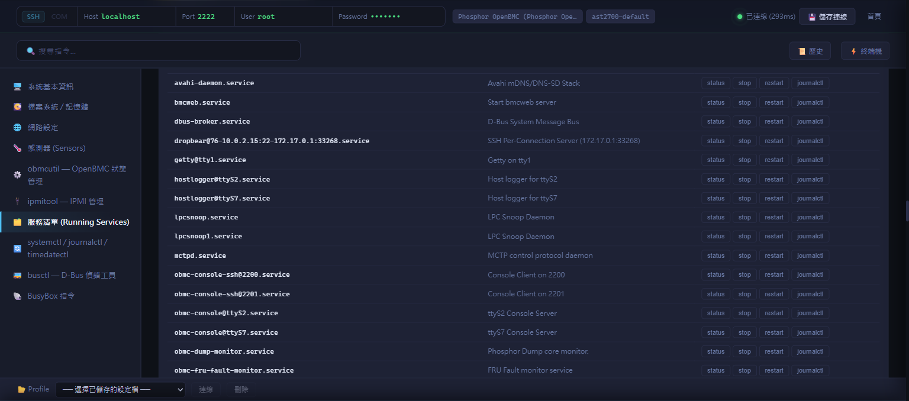

# CommandWebGUI

**BMC 開發輔助工具 — OpenBMC 指令速查 + SSH / Serial 互動執行台**

輕量化瀏覽器工具，專為 BMC 韌體開發人員設計。透過 **SSH** 或 **COM Port** 連線至 OpenBMC 目標機，自動偵測可用工具後動態建立指令面板，無需安裝任何額外軟體。

---

## 介面預覽

### 首頁 — 連線設定與已儲存連線



### 連線欄：SSH 模式 / COM Port 模式


### 主畫面 — 系統資訊與指令面板



### 服務管理面板



---

## 功能

| 功能 | 說明 |
|------|------|
| **雙模式連線** | 支援 SSH 與 COM Port（Serial）兩種連線方式 |
| **工具自動探測** | 連線後自動偵測 `obmcutil`、`ipmitool`、`busctl`、`systemctl`、`fw_printenv` 等工具，動態建立對應指令區塊 |
| **指令速查表** | 依類別分組、可搜尋，點擊即執行 |
| **服務管理面板** | 互動式 running services 列表，支援 status / stop / restart / journalctl 一鍵操作 |
| **內建終端機** | 自由輸入指令，↑↓ 鍵瀏覽歷史 |
| **持久化歷史** | 指令歷史存入 SQLite，重新整理後仍保留 |
| **連線設定檔** | 儲存、編輯、刪除已命名連線；支援匯入／匯出 `.db` 檔案 |
| **ANSI 顏色渲染** | BMC 指令輸出的顏色在瀏覽器中正確顯示 |
| **超長輸出摺疊** | 超過 120 行自動摺疊，點擊可展開 |
| **選用 Basic Auth** | 透過環境變數啟用 Web UI 登入保護 |
| **單檔打包** | 支援 PyInstaller 打包成單一執行檔 |

---

## 環境需求

- Python 3.9+

```
flask>=3.0
paramiko>=3.4
pyserial>=3.5
```

```bash
pip install -r requirements.txt
```

> `pyserial` 為選用套件，未安裝時 COM Port 功能自動停用，SSH 功能不受影響。

---

## 快速啟動

```bash
python main.py
```

伺服器自動選取閒置 port 並開啟瀏覽器，網址會印在終端機：

```
[CommandWebGUI] http://localhost:51234
```

---

## 使用方式

### SSH 連線

1. 連線欄選擇 **SSH**（預設）
2. 填入 Host（BMC IP）、Port（預設 22）、User、Password
3. 點擊**連線**，工具自動探測可用工具並建立指令面板

### COM Port 連線

1. 連線欄選擇 **COM**
2. 從下拉選單選擇偵測到的 COM Port，或手動輸入（Windows：`COM3`；Linux：`/dev/ttyUSB0`）
3. 選擇 Baud Rate（預設 115200）
4. 填入 User 與 Password（用於 serial console 自動登入）
5. 點擊**連線**

### 執行指令

- **點擊指令列** — 立即透過 SSH／Serial 執行
- **底部終端機面板** — 自由輸入指令後按 Enter 或點**執行**
- **↑ / ↓** — 在終端機面板中瀏覽歷史指令
- 標有 ⚠️ 的指令執行前會顯示確認對話框

### 連線設定檔

- 連線成功後點擊 **💾 儲存連線**，輸入名稱存檔
- 首頁卡片顯示已儲存的連線，點擊 **▶ 連線** 直接重連
- 支援編輯（✏️）、刪除（🗑）
- **📂 開啟舊檔** — 從 `.db` 匯入連線（合併，不覆蓋現有）
- **💾 另存新檔** — 匯出所有連線為 `.db` 供備份或分享

---

## 選用：Basic Auth 登入保護

```powershell
# Windows PowerShell
$env:WEBGUI_USER = "admin"
$env:WEBGUI_PASS = "secret"
python main.py
```

```bash
# Linux / macOS
WEBGUI_USER=admin WEBGUI_PASS=secret python main.py
```

未設定環境變數（預設）→ 不需要登入。

---

## 自訂指令表

指令定義在 `static/commands.json`：

```json
{
  "section": "System",
  "requires": "systemctl",
  "cmds": [
    {
      "label": "列出所有服務",
      "cmd": "systemctl list-units --type=service --no-pager",
      "desc": "顯示所有 systemd service"
    },
    {
      "label": "重啟 BMC",
      "cmd": "reboot",
      "warn": true,
      "warnReason": "這會重啟 BMC，確認要執行嗎？"
    }
  ]
}
```

`requires` 指定的工具未偵測到時，整個區塊自動隱藏。

---

## PyInstaller 單檔打包

```bash
pip install pyinstaller

# Windows
pyinstaller --onefile --noconsole ^
  --add-data "templates;templates" ^
  --add-data "static;static" ^
  main.py

# Linux / macOS
pyinstaller --onefile --noconsole \
  --add-data "templates:templates" \
  --add-data "static:static" \
  main.py
```

產生的 `dist/main.exe`（或 `dist/main`）可直接發佈，`profiles.db` 會在同目錄自動建立。

---

## 支援的 BMC 目標環境

| 環境 | SSH | Serial | 備註 |
|------|-----|--------|------|
| OpenBMC（Yocto） | ✅ | ✅ | 完整功能支援 |
| AMI MegaRAC | ✅ | ✅ | `obmcutil` 區塊自動隱藏 |
| BusyBox-only | ✅ | ✅ | 僅顯示基本指令區塊 |
| AST2700 / AST2600 | ✅ | ✅ | 於 ASPEED EVB 驗證 |
| QEMU 模擬 | ✅ | — | 透過 QEMU port forwarding SSH 連線 |

---

## 安全注意事項

- 密碼以**明文儲存**於 `profiles.db`，本工具定位為本機開發工具，若需對外開放請啟用 Basic Auth。
- Basic Auth 使用 Base64 傳輸（非加密），共用網路上建議透過 SSH tunnel 或 VPN 存取。

---

## 授權

MIT
